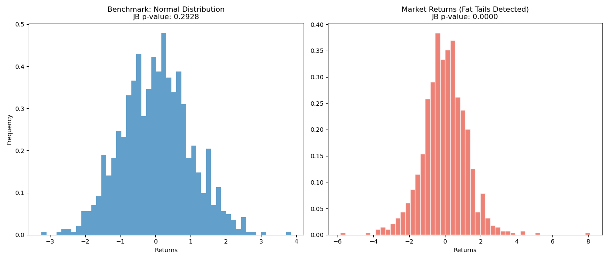

### Problem Statement
The bank’s Market Risk department uses a **Parametric Value-at-Risk (VaR)** model, which assumes that daily asset returns follow a **Normal Distribution**. My objective was to build a diagnostic tool to verify if this assumption holds true for simulated financial returns that exhibit "Fat Tails."

### Methodology
- **Test used**: **Jarque-Bera (JB)** test.
- **Hypothesis**: 
  - $H_0$: Data is normally distributed ($S=0, K=3$).
  - $H_a$: Data is NOT normally distributed.
- **Datasets**: 
  1. A Gaussian Benchmark.
  2. Simulated Stock Returns (Student's t-distribution) to replicate real-world **Excess Kurtosis**.

### Results & Visualization
The JB test successfully identified the non-normality in the market returns dataset.

- **Market Data JB p-value**: < 0.05 (Hypothesis Rejected)
- **Insight**: Since the p-value is near zero, the Normality Assumption is invalid. Using a Parametric VaR on this data would **underestimate extreme tail risks**.

### Technical Implementation
- **Language**: Python
- **Libraries**: `scipy.stats` for the JB test, `matplotlib` for visualization.